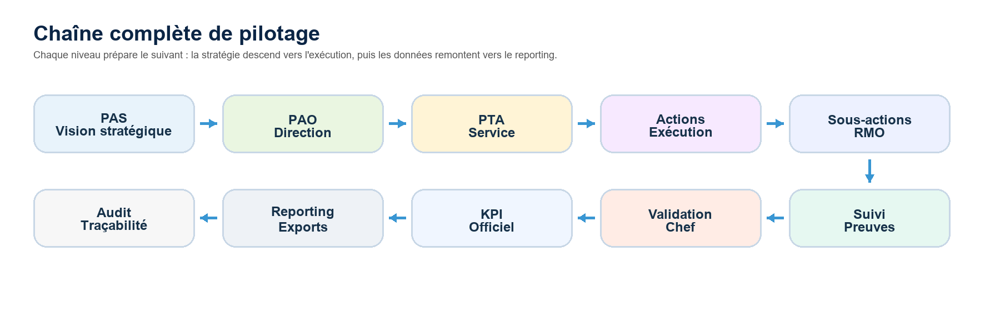
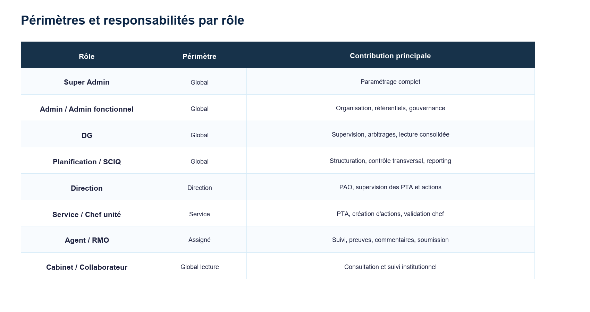
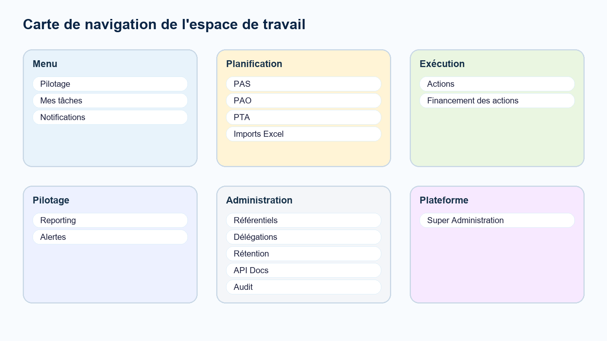
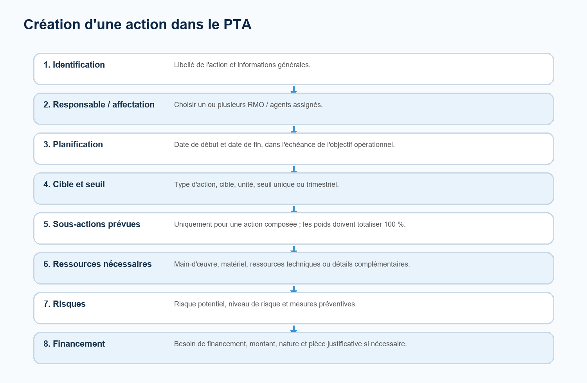
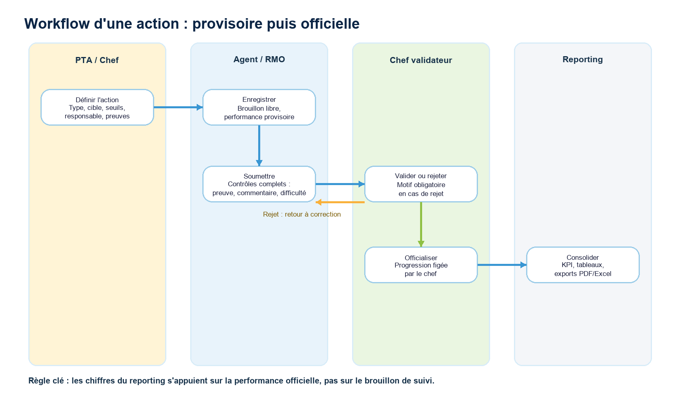
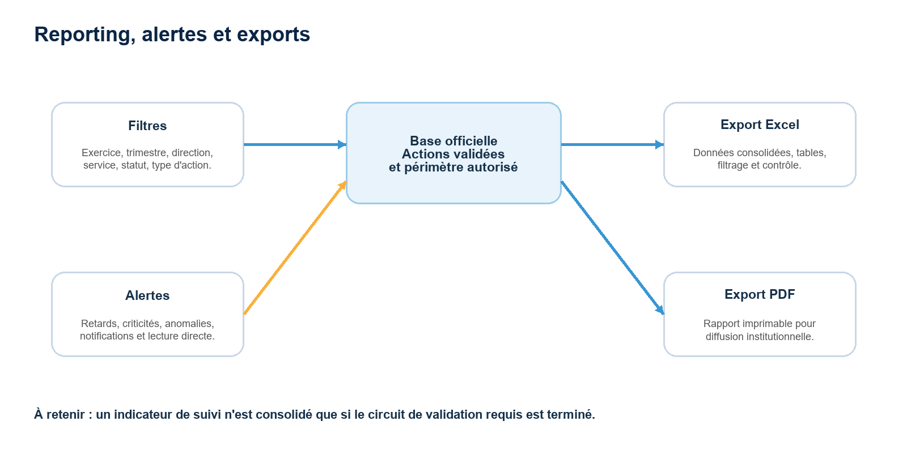
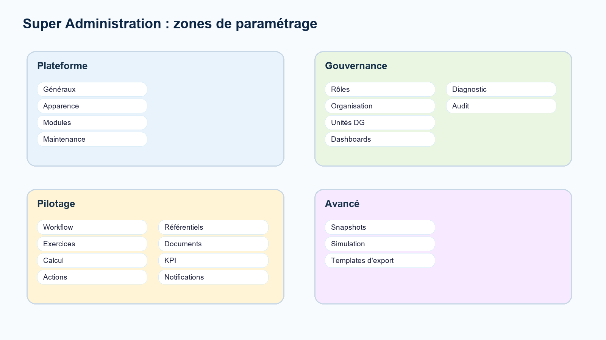

# Manuel d'utilisation de l'application e-Pilotage PAS

**Guide détaillé et illustré pour la planification, le suivi, la validation et le reporting**

**Version 1.0 - 14 juin 2026**

---

## 1. Présentation générale

e-Pilotage PAS est l'application de pilotage stratégique et opérationnel de l'ANBG. Elle permet de partir du Plan d'Actions Stratégique (PAS), de le décliner en Plans d'Actions Opérationnels (PAO), puis en Plans de Travail Annuels (PTA), avant de suivre les actions, leurs justificatifs, leurs validations et leurs indicateurs.

*Illustration 1 - Chaîne PAS, PAO, PTA, actions, suivi, KPI et reporting*

### Ce que l'application permet de faire

- Structurer un PAS avec ses axes stratégiques et ses objectifs stratégiques.
- Décliner le PAS en PAO annuels par direction et par objectif stratégique.
- Construire les PTA des services à partir des objectifs opérationnels transmis.
- Créer les actions dans le PTA, affecter les RMO ou agents, définir les cibles, les seuils, les justificatifs, les risques et les financements.
- Suivre les actions avec quantités réalisées, justificatifs, commentaires et difficultés.
- Valider ou rejeter les réalisations pour officialiser la performance.
- Consulter les tableaux de bord, les alertes, les rapports et les exports PDF/Excel.
- Administrer les rôles, les modules, les référentiels, les exercices, les règles de calcul et les modèles d'export.

> **Principe métier :** Le PTA définit les règles de l'action. Le suivi applique ces règles. La validation du chef officialise la performance. Le reporting utilise la performance officielle.

## 2. Concepts clés à connaître

| Concept | Définition simple | Exemple d'utilisation |
| --- | --- | --- |
| PAS | Plan d'Actions Stratégique pluriannuel. Il contient les axes et objectifs stratégiques. | Définir les priorités institutionnelles sur une période donnée. |
| PAO | Plan d'Actions Opérationnel annuel d'une direction. | Décliner un objectif stratégique en objectifs opérationnels pour la DSIC, la DAF ou une autre direction. |
| PTA | Plan de Travail Annuel d'un service ou d'une unité. | Planifier les actions concrètes du service pour atteindre les objectifs reçus. |
| Action | Unité opérationnelle suivie dans l'application. | Organiser une mission, produire un rapport, réaliser une activité, livrer un indicateur. |
| Sous-action | Découpage d'une action composée entre plusieurs RMO. | Répartir une action en tâches pondérées par responsable. |
| Justificatif | Pièce qui prouve l'exécution ou le financement. | PDF, image, document Word, Excel, photo ou autre preuve autorisée. |
| Performance provisoire | Progression calculée lors du suivi, avant validation. | Un agent enregistre 80 %, mais le chef n'a pas encore validé. |
| Performance officielle | Progression figée après validation du chef. | Seule cette valeur entre dans les statistiques et le reporting. |

### Hiérarchie métier

1. Le PAS fixe la stratégie et les objectifs de haut niveau.
2. Le PAO rattache ces objectifs à une direction et à un exercice.
3. Le PTA récupère les objectifs opérationnels transmis au service.
4. Les actions sont créées dans le PTA, puis suivies dans le module Actions.
5. Les validations transforment les données de suivi en données officielles.
6. Les KPI, alertes et rapports consolident les résultats selon le périmètre autorisé.

## 3. Rôles, périmètres et responsabilités

*Illustration 2 - Vue synthétique des rôles et périmètres*

| Profil | Périmètre habituel | Actions principales |
| --- | --- | --- |
| Super Admin | Global | Paramétrage profond, modules, rôles, workflows, référentiels, maintenance, templates. |
| Admin / Admin fonctionnel | Global | Gestion métier, utilisateurs, référentiels, gouvernance et consultation globale. |
| DG | Global | Supervision globale, arbitrages critiques, lecture consolidée, audit et alertes. |
| Planification / SCIQ | Global | Structuration PAS/PAO/PTA, contrôle transversal, corrections exceptionnelles, reporting. |
| Direction | Direction | Création et suivi du PAO, supervision des PTA et actions de sa direction. |
| Service / Chef unité | Service | Création du PTA, création des actions, affectation des RMO, validation chef. |
| Agent / RMO | Actions assignées | Saisie de l'avancement, justificatifs, difficultés, commentaires et soumission. |
| Cabinet / collaborateur | Lecture globale selon habilitation | Consultation du pilotage, du reporting, des alertes et de l'audit. |

> **Attention :** Les menus visibles dépendent du rôle, du périmètre et de la configuration des modules. Deux utilisateurs peuvent donc voir des menus différents.

## 4. Connexion, sécurité et profil

### Se connecter

1. Ouvrir l'adresse de l'application fournie par l'administrateur.
2. Saisir l'adresse e-mail ou l'identifiant autorisé.
3. Saisir le mot de passe.
4. Cliquer sur Connexion.
5. En cas d'oubli du mot de passe, utiliser le parcours de réinitialisation si celui-ci est activé.

### Mettre à jour son profil

- Accéder au menu Profil ou Paramètres personnels.
- Vérifier le nom complet, l'adresse e-mail, le rôle, la direction et le service de rattachement.
- Ajouter ou remplacer la photo de profil si le champ est disponible.
- Modifier le mot de passe depuis la section Sécurité.
- Révoquer les sessions actives si une connexion semble suspecte.

> **Bonne pratique :** Ne partagez jamais votre compte. Les actions de validation, les commentaires, les exports et les changements sensibles sont journalisés dans l'audit.

## 5. Interface et navigation

L'espace de travail regroupe les modules par famille : Menu, Planification, Exécution, Pilotage, Administration et Plateforme. Les libellés peuvent être personnalisés par le Super Admin, mais la logique reste identique.

*Illustration 3 - Carte des menus principaux*

| Famille | Modules | Utilisation |
| --- | --- | --- |
| Menu | Pilotage, Mes tâches, Notifications | Accès rapide aux synthèses, tâches ouvertes et messages système. |
| Planification | PAS, PAO, PTA, Imports Excel | Création et structuration de la planification. |
| Exécution | Actions, Financement des actions | Suivi, contrôle, validation, financement et justificatifs. |
| Pilotage | Reporting, Alertes | Analyse consolidée, exports et surveillance des écarts. |
| Administration | Référentiels, Délégations, Rétention, API Docs, Audit | Gestion de la donnée de base, traçabilité et gouvernance. |
| Plateforme | Super Administration | Paramétrage avancé de l'application. |

### Utiliser les listes

- Les cartes de synthèse en haut des pages donnent un accès rapide aux statuts importants.
- Les filtres permettent de réduire la liste par recherche, direction, service, année, statut ou responsable selon le module.
- Les boutons Modifier, Clôturer, Archiver ou Supprimer apparaissent uniquement si votre rôle le permet.
- Les actions sensibles déclenchent généralement une confirmation avant exécution.

## 6. Tableau de bord et Mes tâches

Le tableau de bord affiche une synthèse adaptée au rôle connecté : indicateurs de performance, alertes importantes, tâches ouvertes, score personnel, graphiques et tableaux de suivi.

### Mes tâches

- Le bloc Mes tâches signale les éléments qui attendent une action de votre part.
- Chaque tâche contient un titre, un contexte, une échéance et un lien pour traiter directement l'élément.
- Les retards de validation sont rattachés au valideur attendu, pas à l'agent qui a soumis à temps.
- Une tâche peut concerner une correction demandée, une validation chef, un financement, une alerte ou une demande de modification.

### Lire les indicateurs

- Progression déclarée : avancement calculé à partir des saisies de suivi.
- Progression théorique : progression attendue selon le calendrier.
- Performance officielle : valeur validée et utilisée dans les rapports.
- Alertes : écarts, retards, criticités ou anomalies détectés dans le périmètre.

## 7. Module PAS

### Créer un PAS

1. Ouvrir Planification > PAS.
2. Cliquer sur Nouveau PAS.
3. Renseigner le titre du PAS.
4. Renseigner la période de début et la période de fin.
5. Ajouter les axes stratégiques.
6. Sous chaque axe, ajouter au moins un objectif stratégique avec sa date d'échéance.
7. Cliquer sur Créer ou Mettre à jour.

### Champs du PAS

| Champ | Obligatoire | Explication |
| --- | --- | --- |
| Titre du PAS | Oui | Nom du plan stratégique. |
| Période début | Oui | Année de début du PAS. |
| Période fin | Oui | Année de fin du PAS. |
| Axe stratégique | Oui | Grand axe de la stratégie institutionnelle. |
| Objectif stratégique | Oui | Objectif rattaché à un axe. |
| Date d'échéance | Oui | Date limite associée à l'objectif stratégique. |

### Clôturer et archiver

- Un PAS peut être clôturé quand les anomalies bloquantes ont été contrôlées.
- Le rapport d'anomalies peut signaler des PAO ouverts, PTA ouverts, actions en cours, validations en attente, retards ou KPI incomplets.
- L'archivage intervient après clôture et conserve la traçabilité.

## 8. Module PAO

### Créer un PAO

1. Ouvrir Planification > PAO.
2. Cliquer sur Nouveau PAO.
3. Sélectionner l'axe stratégique.
4. Sélectionner l'objectif stratégique rattaché.
5. Vérifier le PAS parent affiché en lecture seule.
6. Sélectionner la direction concernée.
7. Indiquer l'année de l'exercice.
8. Ajouter un ou plusieurs objectifs opérationnels.
9. Pour chaque objectif opérationnel, sélectionner le service concerné et l'échéance.
10. Enregistrer le PAO.

### Règles à respecter

- Le PAO est directionnel : il est rattaché à une direction.
- Le service n'est pas porté par le PAO racine, mais par chaque objectif opérationnel.
- Une direction dispose en principe d'un PAO par exercice.
- Lorsque les champs obligatoires sont complets, la validation peut être automatique selon les règles configurées.
- Les objectifs opérationnels validés sont transmis aux chefs de service concernés.

| Champ PAO | Usage |
| --- | --- |
| Axe stratégique | Filtre l'objectif stratégique disponible. |
| Objectif stratégique | Relie le PAO au PAS. |
| Direction | Définit le périmètre directionnel du PAO. |
| Année | Exercice de planification. |
| Objectif opérationnel | Déclinaison concrète pour un service. |
| Service concerné | Service destinataire de l'objectif opérationnel. |
| Échéance | Date limite qui borne les actions du PTA. |

## 9. Module PTA et création des actions

Le PTA est le point central de création des actions. Le module Actions sert ensuite au suivi, au contrôle, à la validation et à la consultation. Si un utilisateur cherche à créer une action directement depuis Actions, l'application le redirige vers le PTA.

*Illustration 4 - Les étapes de création d'une action dans le PTA*

### Créer un PTA

1. Ouvrir Planification > PTA.
2. Cliquer sur Nouveau PTA.
3. Sélectionner l'objectif opérationnel transmis au service.
4. Vérifier les informations affichées automatiquement : PAO d'origine, PAS lié, axe stratégique, objectif stratégique, direction, service et échéance.
5. Créer les actions liées à l'objectif opérationnel.
6. Enregistrer le PTA.

### Créer une action dans le PTA

1. Déplier le bloc Nouvelle action.
2. Renseigner le libellé de l'action.
3. Choisir le ou les RMO / agents assignés.
4. Indiquer la date de début et la date de fin.
5. Choisir le type d'action : quantitative, non quantitative ou composée.
6. Renseigner la cible, l'unité et les seuils si l'action est quantitative.
7. Ajouter les sous-actions si l'action est composée.
8. Définir les ressources nécessaires, les risques et le financement si nécessaire.
9. Cliquer sur Enregistrer pour sauvegarder l'action.

| Type d'action | Quand l'utiliser | Calcul |
| --- | --- | --- |
| Quantitative | Quand une cible chiffrée existe : nombre de dossiers, montants, formations, livrables quantifiés. | Quantité réalisée / quantité cible. |
| Non quantitative | Quand la réalisation se prouve surtout par une pièce ou un livrable. | 0 % sans preuve, 100 % provisoire avec preuve, officiel après validation. |
| Composée | Quand l'action doit être découpée en sous-actions affectées à plusieurs RMO. | Somme des performances de sous-actions pondérées. |

> **Point de vigilance :** Pour une action composée, la somme des poids des sous-actions doit être égale à 100 %. Cette règle garantit un calcul cohérent de la performance.

## 10. Suivi d'une action

*Illustration 5 - Workflow de suivi et validation d'une action*

### Ouvrir une action

1. Ouvrir Exécution > Actions.
2. Filtrer si nécessaire par statut, direction, service, responsable ou recherche.
3. Cliquer sur Suivi ou ouvrir le détail de l'action.
4. Consulter la fiche, la progression, les justificatifs, la discussion et le journal.

### Enregistrer l'avancement

- Pour une action quantitative, renseigner la quantité réalisée totale à ce jour.
- Pour une action non quantitative, déposer la pièce justificative attendue.
- Pour une sous-action, renseigner l'avancement ou la preuve dans le bloc de la sous-action.
- Ajouter un commentaire si nécessaire ou si le PTA l'a rendu obligatoire.
- Décrire les difficultés rencontrées si le champ est activé.
- Cliquer sur Enregistrer pour garder un brouillon sans déclencher la validation complète.

### Soumettre au chef

1. Vérifier que les champs requis par le PTA sont remplis.
2. Déposer la pièce justificative si elle est obligatoire ou attendue.
3. Compléter le commentaire si le commentaire est obligatoire.
4. Renseigner les difficultés ou écrire Aucune difficulté rencontrée si demandé par la procédure interne.
5. Cliquer sur Soumettre au chef.
6. Attendre la validation ou la demande de correction.

> **Différence essentielle :** Enregistrer calcule une performance provisoire. Soumettre déclenche le contrôle. Valider par le chef fige la performance officielle.

## 11. Validation, corrections et demandes de modification

### Validation chef

- Le chef examine les éléments soumis par l'agent ou le RMO.
- Il vérifie la cohérence de la quantité, des justificatifs, des commentaires et des difficultés.
- S'il valide, l'action ou la sous-action devient officiellement prise en compte.
- S'il rejette, il doit renseigner un motif. L'élément revient en correction.

### Corrections demandées

1. Ouvrir Mes tâches ou le module Actions.
2. Repérer l'action en correction demandée ou rejetée.
3. Lire le motif de rejet dans la discussion ou le journal.
4. Corriger la saisie, le justificatif, le commentaire ou la quantité.
5. Enregistrer puis soumettre à nouveau.

### Demande de modification

- Après enregistrement définitif, certaines actions peuvent être figées en lecture seule.
- Le bouton Demande de modification permet de demander la réouverture.
- La demande suit le circuit contrôleur SCIQ/Planification puis décision DG selon la configuration.
- Le motif doit être clair : erreur de saisie, changement d'échéance, réaffectation, ajustement de cible ou correction de financement.

### Financement

- Si l'action nécessite un financement, le PTA doit indiquer le besoin, le montant, la nature et la pièce justificative.
- Le DAF peut valider et transmettre à la DG, demander un complément ou rejeter.
- La DG peut accorder ou refuser le financement.
- Les décisions, dates, pièces et commentaires restent visibles dans le détail de l'action.

## 12. Reporting, alertes et exports

*Illustration 6 - Reporting, alertes et exports*

### Consulter un rapport

1. Ouvrir Pilotage > Reporting.
2. Choisir le type de rapport métier.
3. Appliquer les filtres : exercice, trimestre, direction, service, statut, type d'action, responsable ou criticité.
4. Analyser les résultats affichés.
5. Exporter en Excel pour analyse détaillée ou en PDF pour diffusion.

### Comprendre la base statistique

- Le reporting respecte le périmètre autorisé de l'utilisateur connecté.
- Les chiffres officiels reposent sur les actions dont le circuit de validation requis est terminé.
- Les filtres modifient les tableaux et les exports.
- Les exports doivent être relus avant diffusion institutionnelle.

### Gérer les alertes

- Les alertes signalent les retards, criticités, anomalies et éléments à traiter.
- Une alerte peut être lue depuis Notifications > Alertes ou depuis le menu Alertes.
- Le bouton Ouvrir mène généralement vers l'action ou l'élément concerné.
- Les alertes non lues peuvent être marquées comme lues individuellement ou en masse selon les droits.

## 13. Référentiels, délégations, audit et gouvernance

### Référentiels

- Directions : créer, modifier ou désactiver les directions selon les droits.
- Services : rattacher chaque service à une direction.
- Utilisateurs : gérer le nom, l'e-mail, le rôle, le périmètre direction/service, le statut actif et la photo.
- Les suppressions sensibles peuvent suivre une demande de suppression plutôt qu'une suppression directe.

### Délégations

- Une délégation donne temporairement à un autre utilisateur la capacité d'intervenir dans un circuit.
- Elle doit préciser le délégant, le délégué, la période, le périmètre et le motif.
- Une délégation doit être annulée dès qu'elle n'est plus nécessaire.

### Audit

- Le journal d'audit conserve les actions sensibles : création, modification, suppression, validation, décisions et changements de configuration.
- Les filtres permettent de rechercher par module, action, utilisateur, entité, date ou texte.
- L'audit sert à contrôler la traçabilité et à comprendre l'historique d'un dossier.

### Rétention et documentation API

- La rétention concerne l'archivage et les règles de conservation des données.
- La documentation API expose les contrats techniques pour les intégrations autorisées.
- Ces modules sont réservés aux profils habilités.

## 14. Super Administration

*Illustration 7 - Zones de paramétrage de la Super Administration*

### Plateforme

- Généraux : textes, logos, paramètres d'identité et formats.
- Apparence : palette, densité et options de lecture.
- Modules : visibilité, ordre et libellés des menus.
- Maintenance : actions techniques, caches et contrôles ponctuels.

### Gouvernance

- Rôles : matrice de permissions, registre des rôles et restauration de versions.
- Organisation : directions, services, comptes utilisateurs et import en masse.
- Unités DG : SCIQ, DGA, Cabinet, UCAS, chefs d'unité et membres.
- Dashboards : cartes et visibilité selon les profils.
- Diagnostic et audit : contrôle plateforme et actions sensibles.

### Pilotage

- Workflow : circuits Actions, PAS, PAO et PTA.
- Exercices : périodes, exercice actif et archivage automatique.
- Calcul : base statistique et règles de calcul des actions.
- Actions : paramètres métier de clôture, suspension et suivi.
- Référentiels dynamiques : libellés, unités, priorités et listes configurables.
- Documents : formats acceptés, rétention et droits liés aux justificatifs.
- Indicateur de performance : registre KPI et moteur de calcul.
- Notifications : événements, escalades et délais.

### Avancé

- Snapshots : sauvegarder, comparer et restaurer une configuration.
- Simulation : vérifier l'impact d'un changement avant application.
- Templates d'export : créer, prévisualiser, publier, archiver et affecter des modèles de rapports.

> **Prudence :** Toute modification dans Super Administration peut changer l'expérience de plusieurs profils. Documentez le motif et utilisez les brouillons, snapshots ou simulations lorsqu'ils sont disponibles.

## 15. Imports Excel

### Importer un fichier

1. Ouvrir Planification > Imports Excel.
2. Télécharger le modèle Excel si nécessaire.
3. Préparer une feuille avec une ligne par action planifiée.
4. Cliquer sur Nouvel import.
5. Choisir le fichier .xlsx ou .csv.
6. Cliquer sur Vérifier le fichier.
7. Analyser la prévisualisation : lignes valides, erreurs et avertissements.
8. Corriger le fichier si nécessaire ou confirmer l'import.

### Conseils de préparation

- Respecter les intitulés et formats du modèle.
- Éviter les cellules fusionnées.
- Vérifier les codes directions, services, objectifs et utilisateurs avant import.
- Contrôler les dates et les montants.
- Lire le rapport d'erreurs si l'import échoue.

## 16. Bonnes pratiques par profil

| Profil | Bonnes pratiques |
| --- | --- |
| Agent / RMO | Mettre à jour l'avancement régulièrement, déposer les preuves, expliquer les difficultés, soumettre dès que les conditions sont remplies. |
| Chef de service | Créer des actions claires, affecter les bons RMO, vérifier les cibles, valider ou rejeter rapidement avec un motif utile. |
| Direction | Contrôler la cohérence du PAO, suivre les PTA de la direction, traiter les alertes de retard et arbitrer les priorités. |
| Planification / SCIQ | Surveiller les anomalies, accompagner les corrections, maintenir la cohérence PAS-PAO-PTA et consolider le reporting. |
| DG | Consulter les synthèses globales, arbitrer les cas critiques, suivre les alertes majeures et les demandes de modification sensibles. |
| Super Admin | Utiliser les snapshots avant changements importants, tester les workflows, vérifier l'audit et limiter les droits sensibles. |

## 17. Problèmes fréquents et solutions

| Situation | Cause probable | Solution |
| --- | --- | --- |
| Je ne vois pas un module | Votre rôle ou la configuration de navigation ne l'autorise pas. | Demander à l'administrateur de vérifier vos droits et modules visibles. |
| Je ne peux pas créer une action depuis Actions | Les actions se créent depuis le PTA. | Aller dans Planification > PTA puis ajouter l'action dans le PTA. |
| Je ne peux pas soumettre | Un champ obligatoire manque : preuve, commentaire, difficulté ou quantité. | Lire les messages d'erreur, compléter les champs, puis soumettre à nouveau. |
| Mon action affiche 100 % mais n'est pas dans le reporting | La performance est encore provisoire. | Attendre ou demander la validation du chef. |
| Je dois modifier une action figée | L'action est enregistrée et verrouillée. | Utiliser Demande de modification et saisir un motif clair. |
| Un export ne correspond pas à mon attendu | Les filtres ou le périmètre changent le résultat. | Vérifier les filtres, l'exercice, le trimestre, la direction et le service. |
| Un justificatif est refusé | Format non autorisé ou pièce incomplète. | Utiliser un format accepté et déposer une pièce lisible. |

## 18. Glossaire

| Terme | Définition |
| --- | --- |
| ANBG | Agence Nationale des Bourses du Gabon. |
| PAS | Plan d'Actions Stratégique. |
| PAO | Plan d'Actions Opérationnel. |
| PTA | Plan de Travail Annuel. |
| RMO | Responsable de mise en œuvre d'une action ou sous-action. |
| KPI | Indicateur de performance. |
| Justificatif | Document ou preuve déposée pour appuyer une réalisation. |
| Soumission | Transmission d'une réalisation au chef pour validation. |
| Validation chef | Décision qui officialise la performance. |
| Alerte | Signal automatique ou manuel indiquant un risque, un retard ou une anomalie. |
| Snapshot | Copie d'une configuration permettant comparaison ou restauration. |
| Périmètre | Champ de visibilité et d'action autorisé pour un utilisateur. |

## 19. Références internes utilisées

- README.md : périmètre fonctionnel, comptes de démonstration et routes principales.
- GUIDE.md : organisation fonctionnelle et technique de l'application.
- docs/spec-workflow-canonique-pas-anbg.md : règles métier PAS, PAO, PTA, actions et validation.
- docs/WORKFLOW-SUIVI-V2.md : principes de suivi, performance provisoire/officielle et validation chef.
- Routes et vues Laravel : menus, formulaires, champs et écrans disponibles dans l'application.
