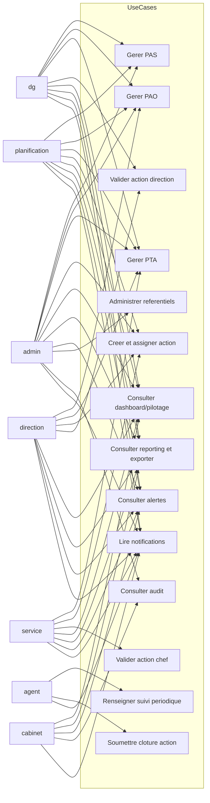
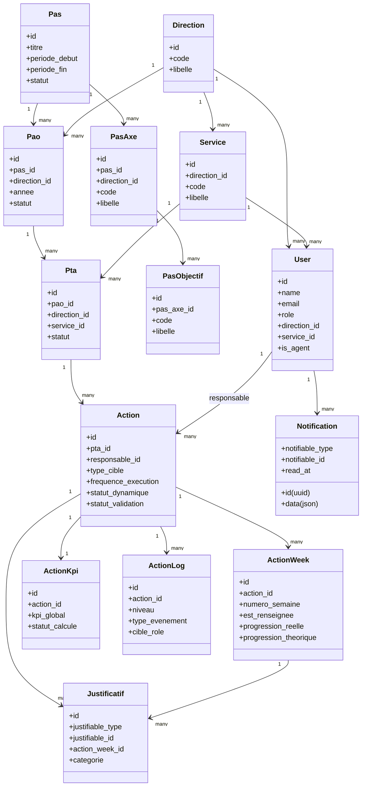
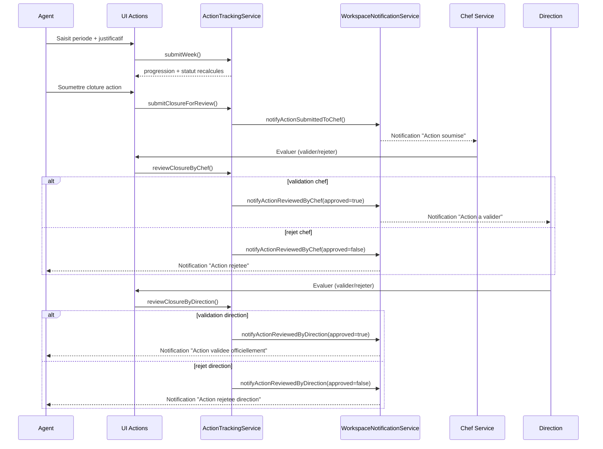
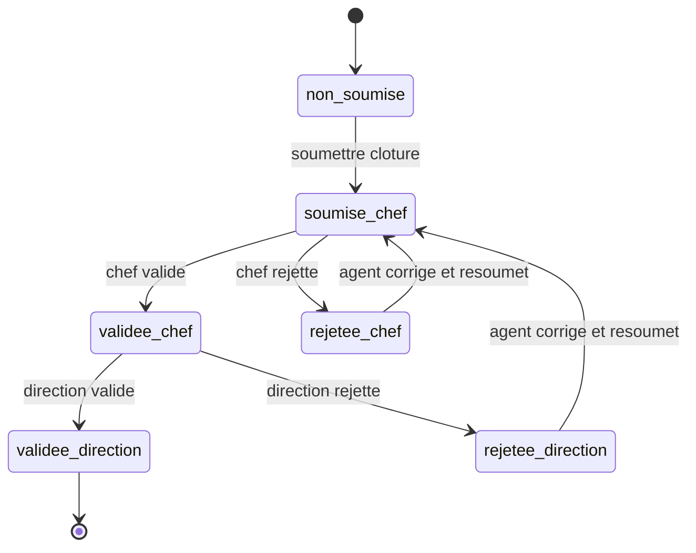

# UML
## Application ANBG PAS / PAO / PTA / Actions

- Version: 1.1
- Date: 2026-03-09

Ce document fournit des diagrammes UML en syntaxe Mermaid.

## 1. Diagramme De Cas D Utilisation

## 2. Diagramme De Classes (Metier)

## 3. Diagramme De Sequence
### Soumission Et Validation D Une Action

## 4. Diagramme D Etats
### Etats De Validation Action

