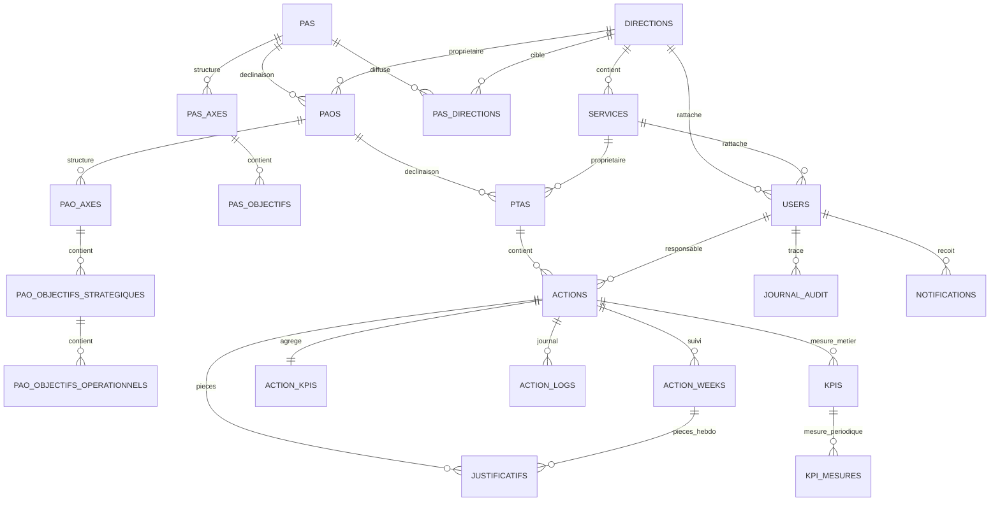

# Modele De Donnees (MCD / MLD)
## Application ANBG PAS / PAO / PTA / Actions

- Version: 1.1
- Date: 2026-03-09

## 1. MCD (Conceptuel)
Entites coeur:

- Organisation: `directions`, `services`, `users`
- Strategie: `pas`, `pas_axes`, `pas_objectifs`, `pas_directions`
- Planification: `paos`, `pao_axes`, `pao_objectifs_strategiques`, `pao_objectifs_operationnels`, `ptas`
- Execution: `actions`, `action_weeks`, `action_kpis`, `action_logs`, `justificatifs`
- Gouvernance: `journal_audit`, `notifications`
- Mesure (back-office): `kpis`, `kpi_mesures`

## 2. Diagramme ER (Mermaid)

## 3. MLD (Logique)
### 3.1 Tables Organisation

- `directions(id PK, code UQ, libelle, actif, created_at, updated_at)`
- `services(id PK, direction_id FK, code, libelle, actif, created_at, updated_at)`
- `users(id PK, name, email UQ, password, role, direction_id FK, service_id FK composite, is_agent, agent_matricule, ...)`

### 3.2 Tables Strategie/Planification

- `pas(id PK, titre, periode_debut, periode_fin, statut, valide_le, valide_par FK)`
- `pas_axes(id PK, pas_id FK, direction_id FK nullable, code, libelle, description, ordre)`
- `pas_objectifs(id PK, pas_axe_id FK, code, libelle, description, indicateur_global, valeur_cible)`
- `pas_directions(id PK, pas_id FK, direction_id FK, unique(pas_id,direction_id))`
- `paos(id PK, pas_id FK, direction_id FK, annee, titre, objectif_operationnel, resultats_attendus, indicateurs_associes, statut, echeance, valide_*)`
- `pao_axes(id PK, pao_id FK, code, libelle, description, ordre)`
- `pao_objectifs_strategiques(id PK, pao_axe_id FK, code, libelle, description, echeance)`
- `pao_objectifs_operationnels(id PK, pao_objectif_strategique_id FK, code, libelle, ... metier execution ...)`
- `ptas(id PK, pao_id FK, direction_id FK, service_id FK composite, titre, description, statut, valide_*)`

### 3.3 Tables Execution

- `actions(id PK, pta_id FK, responsable_id FK, libelle, description, type_cible, unite_cible, quantite_cible, resultat_attendu, criteres_validation, livrable_attendu, date_debut, date_fin, frequence_execution, date_fin_reelle, date_echeance, statut, statut_dynamique, progression_*, seuil_alerte_progression, risques, mesures_preventives, financement_*, ressources_*, rapport_final, validation_hierarchique, validation_sans_correction, statut_validation, soumise_*, evalue_*, direction_valide_*, created_at, updated_at)`
- `action_weeks(id PK, action_id FK, numero_semaine, date_debut, date_fin, est_renseignee, quantite_realisee, quantite_cumulee, taches_realisees, avancement_estime, commentaire, difficultes, mesures_correctives, progression_*, ecart_progression, saisi_par FK, saisi_le, created_at, updated_at)`
- `action_kpis(id PK, action_id FK UQ, kpi_delai, kpi_performance, kpi_conformite, kpi_global, progression_*, statut_calcule, derniere_evaluation_at)`
- `action_logs(id PK, action_id FK, action_week_id FK nullable, niveau, type_evenement, message, details JSON, cible_role, utilisateur_id FK nullable, lu, created_at, updated_at)`
- `justificatifs(id PK, justifiable_type, justifiable_id, action_week_id FK nullable, categorie, nom_original, chemin_stockage, mime_type, taille_octets, description, ajoute_par FK nullable, created_at, updated_at)`

### 3.4 Tables Gouvernance

- `journal_audit(id PK, user_id FK nullable, module, entite_type, entite_id, action, ancienne_valeur JSON, nouvelle_valeur JSON, adresse_ip, user_agent, created_at, updated_at)`
- `notifications(id UUID PK, type, notifiable_type, notifiable_id, data TEXT(JSON), read_at, created_at, updated_at)`

### 3.5 Tables Mesure (Back-office)

- `kpis(id PK, action_id FK, libelle, unite, cible, seuil_alerte, periodicite, created_at, updated_at)`
- `kpi_mesures(id PK, kpi_id FK, periode, valeur, commentaire, saisi_par FK nullable, created_at, updated_at, unique(kpi_id,periode))`

## 4. Contraintes Structurantes

- `services(direction_id, code)` unique
- `paos(pas_id, annee, direction_id)` unique
- `ptas(pao_id, service_id)` unique
- `action_weeks(action_id, numero_semaine)` unique
- `action_kpis(action_id)` unique
- FK composite de coherence direction/service sur `users` et `ptas`

## 5. Index Cles

- `actions(pta_id, statut)`
- `actions(statut_dynamique, date_fin)`
- `action_weeks(action_id, est_renseignee)`
- `action_logs(action_id, niveau, created_at)`
- `action_logs(cible_role, lu)`
- `journal_audit(entite_type, entite_id)`
- `journal_audit(module, action)`

## 6. Enumerations Metier Importantes
PAS/PAO/PTA:

- `brouillon`, `soumis`, `valide`, `verrouille`

Action dynamique:

- `non_demarre`, `en_cours`, `en_avance`, `en_retard`, `acheve_dans_delai`, `acheve_hors_delai`

Validation action:

- `non_soumise`, `soumise_chef`, `rejetee_chef`, `validee_chef`, `rejetee_direction`, `validee_direction`

Frequence execution:

- `instantanee`, `journaliere`, `hebdomadaire`, `mensuelle`, `annuelle`

## 7. Notes D Evolution

- `action_justificatifs` a ete migree vers `justificatifs` polymorphe.
- les tables `school_*` existent en base mais ne sont pas dans le parcours metier principal de cette application.
- `kpis` et `kpi_mesures` restent disponibles pour calcul/graphes back-office meme si non exposes comme module principal.
